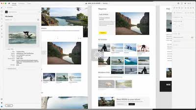
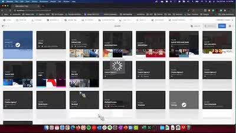
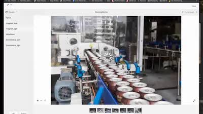

# [!DNL Experience Manager]個技能培養錄製

歡迎使用Adobe [!DNL Experience Manager] Skill Builder錄製首頁，其中包含專為建立您的知識庫和最大化您對Adobe [!DNL Experience Manager]的投資而設計的錄製網路研討會。

## 新增功能

<table>
<tr>
  <td>
    
    

      <a href="https://experienceleague.adobe.com/zh-hant/docs/experience-manager-skill-builder/skill-builder/for-2020/asset-link">
    <strong>[!DNL Asset Link]</strong>
    </a>
    

    

    <em>[!DNL Asset Link]是您與Adobe Creative Cloud的原生連線。</em>
    

  </td>
  <td>
    
    

    <a href="https://experienceleague.adobe.com/zh-hant/docs/experience-manager-skill-builder/skill-builder/for-2020/brand-portal">
    <strong>Brand Portal</strong>
    </a>
    

    

    <em>與內部和外部團隊輕鬆共用資產。</em>
    

  </td>
  <td>
    
     

      <a href="https://experienceleague.adobe.com/zh-hant/docs/experience-manager-skill-builder/skill-builder/for-2020/dynamic-media">
        <strong>[!DNL Dynamic Media]</strong>
      </a>
    

    

    <em>自動輸出所有管道和熒幕的資產。</em>
    

  </td>
</tr>
</table>

>[!TIP]
>
>**檢視左側導覽，瞭解先前技能培養活動錄製的情形**。
